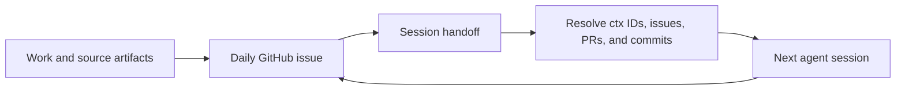

# Ephemeris

[](#status)
[](skills/daily-handoff/SKILL.md)
[](LICENSE)
[](LICENSE-docs)

**English** · [Русский](README.ru.md)

Ephemeris is a Claude Code plugin and Codex skill for issue-based daily
handoffs. One daily issue keeps the state of a project day. When an agent
session ends, it leaves source addresses for the next session instead of
rewriting the same context into another summary.

The package contains agent instructions, not an application or background
service. GitHub issues remain the visible record, while project evidence can
stay in its original repository or archive.

## Daily cycle

| Command | Purpose |
|---|---|
| `/ephemeris:init` | Open the daily issue and carry over unfinished work. |
| `/ephemeris:update` | Update state and append technical notes during the day. |
| `/ephemeris:pass` | Hand the current session to another session without closing the day. |
| `/ephemeris:handoff` | Finish the day, record the final state, and mark it ready for cleanup. |
| `/ephemeris:resume` | Resolve the recorded addresses and continue from verified context. |



## Requirements

- [`gh`](https://cli.github.com/), authenticated for the repository that stores
  the daily issues.
- **A repository for the dailies.** Ephemeris does not create the convention,
  it follows one. That repository holds one issue per (date, project) and keeps
  the body template in its own `README.md`.

Ephemeris reads that template before writing anything, and never stores a copy
of it. Reporting formats change; a copy inside a plugin would fall behind in
silence.

## Install

Claude Code:

```
/plugin marketplace add ZenonEl/ephemeris
/plugin install ephemeris@ephemeris
```

Codex uses the same skill without the commands. Link it into the skill
directory:

```bash
ln -s "$PWD/skills/daily-handoff" ~/.codex/skills/daily-handoff
```

There it is triggered by phrasing rather than by a slash command.

## Configuration

Repository addresses live outside this package, in
`~/.config/ephemeris/daily.conf`:

```ini
default = work

[work]
repo     = <owner>/<repo>
assignee = @<login>

[personal]
repo     = <owner>/<repo>
```

Every section is a contour. `assignee` is optional — contours may follow
different conventions, and Ephemeris reads each one from its own repository
rather than carrying settings across.

If the file or the requested contour is missing, the instructions require the
agent to ask instead of guessing a default.

## Design choices

### A handoff is an address map

A copied summary becomes a second version of nearby information and can drift
from it. Ephemeris records stable addresses instead: a GitHub comment ID, an
issue or pull request, a commit, a path, or a `ctx:<slug>#<id>` citation. The
receiving session resolves each address and reports anything it cannot open.

The reader decides what to open. An address costs almost nothing to carry and
can be followed later; a summary spends context on a decision that was already
made by someone else.

### A day and a session are different units

Several agent sessions may work during one day. `pass` closes only the current
session; `handoff` closes the work day. This keeps one daily issue per project
and date without forcing intermediate sessions to write a final report.

### Work and personal records stay separate

Ephemeris selects a configured contour before it writes anything. Work and
personal dailies use different repositories rather than labels in one shared
repository. If the contour cannot be selected unambiguously, the instructions
require the agent to ask.

### Cleanup is explicit

A completed handoff receives the `ready-to-close` label. On a later week,
Ephemeris can propose closing older labelled dailies for the same project. It
shows the list first and waits for confirmation.

A daily without the label stays open on purpose: it was never handed off, and
closing it silently would erase that signal.

## Place in the toolchain

| Project | Responsibility |
|---|---|
| [mnemo](https://github.com/ZenonEl/mnemo) | Stores source material, provenance, decisions, and open questions. |
| **Ephemeris** | Tracks the day and passes source addresses between sessions. |
| [herald](https://github.com/ZenonEl/herald) | Moves messages and files between people and agents. |

The projects exchange published formats and links. They do not share a runtime,
database, or library.

## Package layout

```text
.claude-plugin/          Claude Code plugin and marketplace manifests
commands/                Five Claude Code commands
skills/daily-handoff/    The portable skill used by Codex
```

## Status

Ephemeris is an early `0.5.0` specification package maintained by one author.
It has no executable code, automated tests, CI, or usage telemetry. The current
value is the documented handoff protocol and its separation of daily state,
source evidence, and communication.

Command descriptions and the skill body are written in Russian, the working
language of its author.

## Licenses

- `commands/` and `skills/`: [AGPL-3.0-or-later](LICENSE)
- documentation: [CC BY-SA 4.0](LICENSE-docs)
