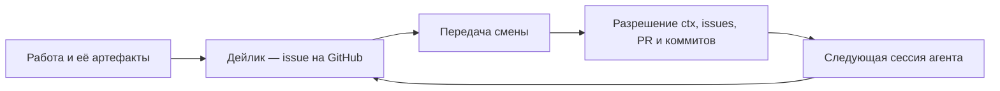

# Ephemeris

[](#статус)
[](skills/daily-handoff/SKILL.md)
[](LICENSE)
[](LICENSE-docs)

[English](README.md) · **Русский**

Ephemeris — плагин Claude Code и навык Codex для передачи смены через дейлики.
Один issue держит состояние рабочего дня по проекту. Когда сессия агента
кончается, она оставляет следующей **адреса источников**, а не ещё один пересказ
того же контекста.

Пакет содержит инструкции для агента, а не приложение и не фоновую службу.
Видимой записью остаются issues на GitHub, а материал работы может лежать там,
где лежал — в своём репозитории или архиве.

## Цикл дня

| Команда | Что делает |
|---|---|
| `/ephemeris:init` | Завести дейлик и перенести незакрытое со вчера. |
| `/ephemeris:update` | Обновить состояние и дописать технические заметки по ходу дня. |
| `/ephemeris:pass` | Передать сессию другой сессии, не закрывая день. |
| `/ephemeris:handoff` | Сдать день, записать итоговое состояние и пометить готовым к закрытию. |
| `/ephemeris:resume` | Разрешить записанные адреса и продолжить с проверенного контекста. |



## Что нужно

- [`gh`](https://cli.github.com/) с доступом к репозиторию, где живут дейлики.
- **Сам репозиторий дейликов.** Ephemeris не выдумывает соглашение, а следует
  готовому: один issue на пару (дата, проект), а шаблон тела лежит в `README.md`
  этого же репозитория.

Шаблон читается оттуда перед каждой записью и здесь не хранится. Формат
отчётности меняется, а копия внутри плагина отстала бы молча.

## Установка

Claude Code:

```
/plugin marketplace add ZenonEl/ephemeris
/plugin install ephemeris@ephemeris
```

Codex использует тот же навык, но без команд. Прилинковать в каталог навыков:

```bash
ln -s "$PWD/skills/daily-handoff" ~/.codex/skills/daily-handoff
```

Там он срабатывает по формулировке, а не по слэш-команде.

## Настройка

Адреса репозиториев лежат вне пакета, в `~/.config/ephemeris/daily.conf`:

```ini
default = work

[work]
repo     = <owner>/<repo>
assignee = @<login>

[personal]
repo     = <owner>/<repo>
```

Каждая секция — контур. `assignee` необязателен: у контуров разные соглашения,
и Ephemeris читает каждое из его собственного репозитория, а не переносит
настройки из одного в другой.

Нет файла или нужного контура — инструкция требует спросить, а не подставлять
что-то по умолчанию.

## Устройство

### Передача — карта адресов

Скопированный пересказ становится второй версией того, что лежит рядом, и
расходится с ней. Ephemeris записывает вместо этого устойчивые адреса:
идентификатор комментария, issue или pull request, коммит, путь, ссылку
`ctx:<slug>#<id>`. Принимающая сессия разрешает каждый адрес и говорит вслух о
том, что открыть не удалось.

Что открывать — решает читающий. Адрес почти ничего не стоит и его можно
пройти позже; пересказ тратит контекст на решение, принятое за тебя вчера.

### День и сессия — разные единицы

За день над задачей может работать несколько сессий. `pass` закрывает только
текущую сессию, `handoff` — рабочий день. Так на пару (проект, дата) остаётся
один дейлик, а промежуточные сессии не обязаны писать итоговый отчёт.

### Рабочее и личное разведены

Контур выбирается до первой записи. Рабочие и личные дейлики живут в **разных
репозиториях**, а не под разными метками в одном. Если контур не определяется
однозначно, инструкция требует спросить.

### Чистка — явная

Сданный день получает метку `ready-to-close`. На следующей неделе Ephemeris
может предложить закрыть старые помеченные дейлики того же проекта. Сначала
показывает список и ждёт подтверждения.

Дейлик без метки остаётся открытым намеренно: его не сдавали, и закрыть его
молча значит стереть этот признак.

## Место в связке

| Проект | Роль |
|---|---|
| [mnemo](https://github.com/ZenonEl/mnemo) | Хранит материал, провенанс, решения и открытые вопросы. |
| **Ephemeris** | Ведёт день и передаёт адреса источников между сессиями. |
| [herald](https://github.com/ZenonEl/herald) | Носит сообщения и файлы между людьми и агентами. |

Проекты обмениваются опубликованными форматами и ссылками. Общей среды
выполнения, базы или библиотеки у них нет.

## Состав пакета

```text
.claude-plugin/          манифесты плагина и маркетплейса Claude Code
commands/                пять команд Claude Code
skills/daily-handoff/    переносимый навык, он же используется в Codex
```

## Статус

Ephemeris — ранний пакет спецификации версии `0.5.0`, у него один автор.
Исполняемого кода, автотестов, CI и телеметрии нет. Ценность на сегодня — сам
описанный протокол передачи и разделение состояния дня, материала и связи.

## Лицензии

- `commands/` и `skills/`: [AGPL-3.0-or-later](LICENSE)
- документация: [CC BY-SA 4.0](LICENSE-docs)
